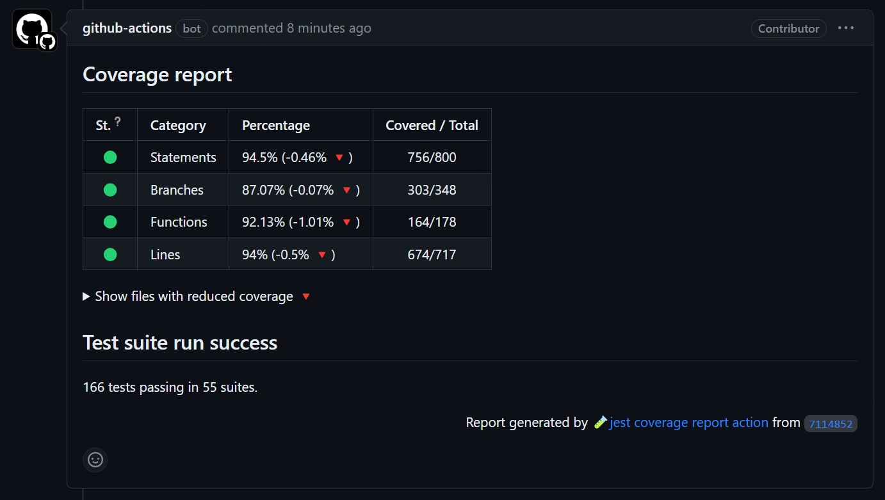
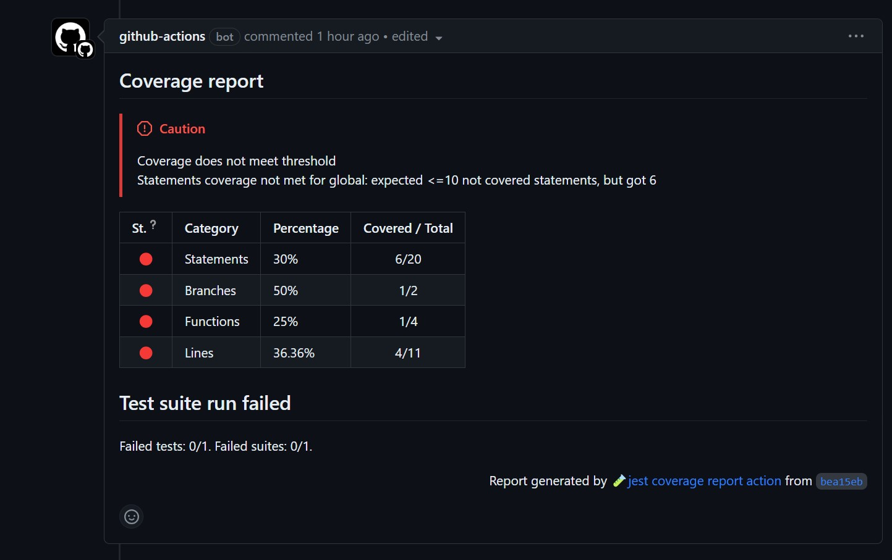

# jest coverage report 🧪

<p align="center">
  
</p>

<p align="center">
    A GitHub action that reports about your code coverage in every pull request.
</p>

<p align="center">
    <a href="https://github.com/ArtiomTr/jest-coverage-report-action"></img></a>
    <a href="https://github.com/ArtiomTr/jest-coverage-report-action/issues"></img></a>
</p>

This action uses [Jest](https://github.com/facebook/jest) to extract code coverage, and comments it on pull request. Inspired by [Size-limit action](https://github.com/andresz1/size-limit-action/). Features:

-   **Reporting** code coverage on each pull request. 📃
-   **Rejecting** pull request, if coverage is under threshold. ❌
-   **Comparing** coverage with base branch. 🔍
-   Showing spoiler in the comment for all **new covered files**. 🆕
-   Showing spoiler in the comment for all files, in which **coverage was reduced**. 🔻
-   Failed tests & uncovered line **annotations** 📢

<p align="center">
  
</p>

## Usage

1. Install and configure [Jest](https://github.com/facebook/jest).
2. Create new action inside `.github/workflows`:

**Minimal configuration**

```yml
name: 'coverage'
on:
    pull_request:
        branches:
            - master
            - main
jobs:
    coverage:
        permissions:
            checks: write
            pull-requests: write
        runs-on: ubuntu-latest
        steps:
            - uses: actions/checkout@v1
            - uses: ArtiomTr/jest-coverage-report-action@v2
```

3. Pay attention to the action parameters. You can specify custom [threshold](#specify-threshold), [pre-test-script](#specify-pre-test-script) or [test script](#customizing-test-script)
4. That's it!

## Custom token

By default, this action takes `github.token` variable to publish reports on your PR. You can overwrite this property by specifying:

```yml
with:
    github-token: ${{ secrets.SECRET_TOKEN }}
```

## Specify threshold

This action automatically suports jest's [`coverageThreshold`](https://jestjs.io/docs/configuration#coveragethreshold-object) property.
Just add into your `jest.config.js` file:

```js
module.exports = {
    coverageThreshold: {
        global: {
            lines: 80,
        },
    },
};
```

## Custom working directory

If you want to run this action in custom directory, specify `working-directory`:

```yml
with:
    working-directory: <dir>
```

## Specify pre test script

By default, this action does nothing

If you want to run any command before the test-script is run, pass the custom option `pre-test-script`.

```yml
with:
    github-token: ${{ secrets.GITHUB_TOKEN }}
    pre-test-script: npm run codegen
    test-script: npm run test:coverage
```

## Customizing test script

This action automatically adds necessary flags to your test script. The default script is:

```
npx jest
```

So you don't need to specify additional flags - action will handle them
automatically. So, after adding necessary flags, action will run this command:

```
npx jest --ci --json --coverage --testLocationInResults --outputFile=report.json
```

But you do not need to specify these flags manually. Also, you can use different package manager, `yarn` for example:

```yml
with:
    test-script: yarn jest
```

Or, if you would like to run a script from your `package.json`:

```yml
with:
    test-script: npm test
```

## Usage with `yarn` or `pnpm`

By default, this action will install your dependencies using `npm`. If you are using `yarn` or `pnpm`, you can specify it in the `package-manager` option:

```yml
with:
    package-manager: yarn
```

or

```yml
with:
    package-manager: pnpm
```

## Use existing test report(s)

To bypass running unit tests, you can pass the filepath to the current report.json

```yml
with:
    coverage-file: ./coverage/report.json
    base-coverage-file: ./coverage/master/report.json
```

-   `coverage-file` is the filepath to the JSON coverage report for the current pull request.
-   `base-coverage-file` is the filepath to the JSON coverage report from the branch your pull request is merging into.

For example, you can save every test run to an artifact and then download and reference them here.

## Opt-out coverage comparison features

You can opt-out coverage comparison features to speed-up action. To achieve this, firstly, manually collect coverage to `report.json` file. Then, specify these options for the action:

```yml
with:
    coverage-file: report.json
    base-coverage-file: report.json
```

## Skipping steps

> Note: this option affects only coverage for the "head" branch. For skipping steps of "base" branch, see [`base-coverage-file`](#use-existing-test-reports) option.

By default, this action will install dependencies and run the tests for you, generating the coverage report. Alternatively, you can skip these steps using the `skip-step` option.

```yml
with:
    skip-step: all
```

Accepted values are:

-   `none` (default) - all steps will be run
-   `install` - skip installing dependencies
-   `all` - skip installing dependencies _and_ running the test script

## Change annotations

To change annotations, you have to set the annotations option as shown below:

```yml
with:
    annotations: none
```

Accepted values are:

-   `all` (default) - Will annotate sections of your code that failed tests or test did not cover
-   `none` - Turns off annotations
-   `coverage` - Will annotate those sections of your code that test did not cover
-   `failed-tests` - Will annotate those sections of your code that failed test

## Contributing

Pull requests are welcome. For major changes, please open an issue first to discuss what you would like to change.

Please make sure to update tests as appropriate.

Jest Coverage Report action is made with <3 thanks to these wonderful people
([emoji key ✨](https://allcontributors.org/docs/en/emoji-key)):

<!-- ALL-CONTRIBUTORS-LIST:START - Do not remove or modify this section -->
<!-- prettier-ignore-start -->
<!-- markdownlint-disable -->
<table>
  <tr>
    <td align="center"><a href="https://github.com/ArtiomTr"><br /><sub><b>Artiom Tretjakovas</b></sub></a><br /><a href="https://github.com/ArtiomTr/jest-coverage-report-action/commits?author=ArtiomTr" title="Code">💻</a> <a href="https://github.com/ArtiomTr/jest-coverage-report-action/commits?author=ArtiomTr" title="Documentation">📖</a> <a href="https://github.com/ArtiomTr/jest-coverage-report-action/pulls?q=is%3Apr+reviewed-by%3AArtiomTr" title="Reviewed Pull Requests">👀</a> <a href="#maintenance-ArtiomTr" title="Maintenance">🚧</a> <a href="#content-ArtiomTr" title="Content">🖋</a></td>
    <td align="center"><a href="https://github.com/taschetto"><br /><sub><b>Guilherme Taschetto</b></sub></a><br /><a href="https://github.com/ArtiomTr/jest-coverage-report-action/commits?author=taschetto" title="Code">💻</a> <a href="https://github.com/ArtiomTr/jest-coverage-report-action/commits?author=taschetto" title="Documentation">📖</a></td>
    <td align="center"><a href="http://adamtuttle.codes"><br /><sub><b>Adam Tuttle</b></sub></a><br /><a href="https://github.com/ArtiomTr/jest-coverage-report-action/commits?author=atuttle" title="Code">💻</a></td>
    <td align="center"><a href="https://github.com/dadayama"><br /><sub><b>dadayama</b></sub></a><br /><a href="https://github.com/ArtiomTr/jest-coverage-report-action/commits?author=dadayama" title="Code">💻</a></td>
    <td align="center"><a href="http://bluelovers.net"><br /><sub><b>bluelovers</b></sub></a><br /><a href="https://github.com/ArtiomTr/jest-coverage-report-action/commits?author=bluelovers" title="Documentation">📖</a></td>
    <td align="center"><a href="https://github.com/gdelahodde-masteos"><br /><sub><b>gdelahodde-masteos</b></sub></a><br /><a href="https://github.com/ArtiomTr/jest-coverage-report-action/commits?author=gdelahodde-masteos" title="Code">💻</a> <a href="https://github.com/ArtiomTr/jest-coverage-report-action/commits?author=gdelahodde-masteos" title="Documentation">📖</a></td>
    <td align="center"><a href="https://github.com/jlim9333"><br /><sub><b>jlim9333</b></sub></a><br /><a href="https://github.com/ArtiomTr/jest-coverage-report-action/commits?author=jlim9333" title="Code">💻</a></td>
  </tr>
  <tr>
    <td align="center"><a href="http://blog.mozmonkey.com"><br /><sub><b>Jeremy Gillick</b></sub></a><br /><a href="https://github.com/ArtiomTr/jest-coverage-report-action/commits?author=jgillick" title="Code">💻</a> <a href="https://github.com/ArtiomTr/jest-coverage-report-action/commits?author=jgillick" title="Documentation">📖</a></td>
    <td align="center"><a href="http://zajo.io"><br /><sub><b>Matej Zajo Kralik</b></sub></a><br /><a href="https://github.com/ArtiomTr/jest-coverage-report-action/commits?author=Zajozor" title="Code">💻</a></td>
    <td align="center"><a href="http://sidharth.dev"><br /><sub><b>Sidharth Vinod</b></sub></a><br /><a href="https://github.com/ArtiomTr/jest-coverage-report-action/commits?author=sidharthv96" title="Code">💻</a></td>
    <td align="center"><a href="https://jaylenwimbish.com"><br /><sub><b>Jaylen Wimbish</b></sub></a><br /><a href="https://github.com/ArtiomTr/jest-coverage-report-action/commits?author=jaylenw" title="Documentation">📖</a></td>
    <td align="center"><a href="https://github.com/princeIta"><br /><sub><b>princeIta</b></sub></a><br /><a href="https://github.com/ArtiomTr/jest-coverage-report-action/commits?author=princeIta" title="Documentation">📖</a></td>
    <td align="center"><a href="https://brianwhitton.com"><br /><sub><b>Brian Whitton</b></sub></a><br /><a href="https://github.com/ArtiomTr/jest-coverage-report-action/commits?author=noslouch" title="Code">💻</a> <a href="https://github.com/ArtiomTr/jest-coverage-report-action/issues?q=author%3Anoslouch" title="Bug reports">🐛</a></td>
    <td align="center"><a href="https://github.com/BohdanPetryshyn"><br /><sub><b>Bohdan Petryshyn</b></sub></a><br /><a href="https://github.com/ArtiomTr/jest-coverage-report-action/commits?author=BohdanPetryshyn" title="Code">💻</a></td>
  </tr>
  <tr>
    <td align="center"><a href="https://github.com/herberttn"><br /><sub><b>Herbert Treis Neto</b></sub></a><br /><a href="https://github.com/ArtiomTr/jest-coverage-report-action/commits?author=herberttn" title="Code">💻</a></td>
    <td align="center"><a href="https://lifterlms.com"><br /><sub><b>Thomas Patrick Levy</b></sub></a><br /><a href="https://github.com/ArtiomTr/jest-coverage-report-action/commits?author=thomasplevy" title="Code">💻</a></td>
    <td align="center"><a href="https://github.com/laurislokalise"><br /><sub><b>Lauris Mikāls</b></sub></a><br /><a href="https://github.com/ArtiomTr/jest-coverage-report-action/commits?author=laurislokalise" title="Code">💻</a></td>
    <td align="center"><a href="https://github.com/rena-h"><br /><sub><b>Rena Hamada</b></sub></a><br /><a href="https://github.com/ArtiomTr/jest-coverage-report-action/commits?author=rena-h" title="Documentation">📖</a></td>
    <td align="center"><a href="https://jacob.cs.ie　　　　　　　　　　　　　　　　@jacob.pages.dev/"><br /><sub><b>JacobLinCool</b></sub></a><br /><a href="https://github.com/ArtiomTr/jest-coverage-report-action/commits?author=JacobLinCool" title="Code">💻</a> <a href="https://github.com/ArtiomTr/jest-coverage-report-action/commits?author=JacobLinCool" title="Documentation">📖</a></td>
    <td align="center"><a href="http://tommasoferrari.com"><br /><sub><b>Tommaso Ferrari</b></sub></a><br /><a href="https://github.com/ArtiomTr/jest-coverage-report-action/commits?author=raspo" title="Code">💻</a></td>
    <td align="center"><a href="https://github.com/Raigen"><br /><sub><b>Florian</b></sub></a><br /><a href="https://github.com/ArtiomTr/jest-coverage-report-action/commits?author=Raigen" title="Code">💻</a></td>
  </tr>
</table>

<!-- markdownlint-restore -->
<!-- prettier-ignore-end -->

<!-- ALL-CONTRIBUTORS-LIST:END -->

## License

MIT © [Artiom Tretjakovas](https://github.com/ArtiomTr)
