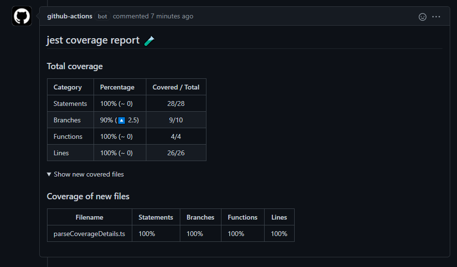

# jest coverage report 🧪

<p align="center">
  
</p>

<p align="center">
    A GitHub action that reports about your code coverage in every pull request.
</p>

<p align="center">
    <a href="https://github.com/ArtiomTr/jest-coverage-report-action"></img></a>
    <a href="https://github.com/ArtiomTr/jest-coverage-report-action/issues"></img></a>
</p>

This action uses [Jest](https://github.com/facebook/jest) to extract code coverage, and comments it on pull request. Inspired by [Size-limit action](https://github.com/andresz1/size-limit-action/). Features:

-   **Reporting** code coverage on each pull request. 📃
-   **Rejecting** pull request, if coverage is under threshold. ❌
-   **Comparing** coverage with base branch. 🔍
-   Showing spoiler in the comment for all **new covered files**. 🆕
-   Showing spoiler in the comment for all files, in which **coverage was reduced**. 🔻

<p align="center">
  
</p>

## Usage

1. Install and configure [Jest](https://github.com/facebook/jest).
2. Create new action inside `.github/workflows`:

**Minimal configuration**

```yml
name: 'coverage'
on:
    pull_request:
        branches:
            - master
jobs:
    coverage:
        runs-on: ubuntu-latest
        env:
            CI_JOB_NUMBER: 1
        steps:
            - uses: actions/checkout@v1
            - uses: artiomtr/jest-coverage-report-action@v1.3
              with:
                  github-token: ${{ secrets.GITHUB_TOKEN }}
                  #   threshold: 80 # optional parameter
```

3. Pay attention to the action parameters. You can specify custom [threshold](#specify-threshold) or [test script](#customizing-test-script)
4. That's it!

## Specify threshold

If you want to set minimal accepted coverage for the PR, you can pass and optional parameter threshold.

For example, if you want to reject every pull request, with total line coverage less than 80%:

```yml
with:
    github-token: ${{ secrets.GITHUB_TOKEN }}
    threshold: 80 # value in percents
```

## Custom working directory

If you want to run this action in custom directory, specify `working-directory`:

```yml
with:
    github-token: ${{ secrets.GITHUB_TOKEN }}
    working-directory: <dir>
```

## Customizing test script

By default, this action will run this command, to extract coverage:

```bash
npx jest --silent --ci --coverage --coverageReporters="text" --coverageReporters="text-summary"
```

If you're not satisfied with default behaviour, you can specify your own command, by passing custom option `test-script`.

> **⚠ IMPORTANT ⚠:** Please, note that this is not simple `npx jest --coverage` script call. If you're specify your custom script, **YOU SHOULD PASS SAME COVERAGE REPORTERS** as it does default script (`text` and `text-summary` reporters). Without those options, your action will not work.

For instance, if you want to run `test:coverage` npm script:

```yml
with:
    github-token: ${{ secrets.GITHUB_TOKEN }}
    test-script: npm run test:coverage
```

## Skipping steps

By default, this action will install dependencies and run the tests for you, generating the coverage report. Alternatively, you can skip these steps using the `skip-steps` option.

```yml
with:
    github-token: ${{ secrets.GITHUB_TOKEN }}
    skip-steps: all
```

Accepted values are:

- `none` (default) - all steps will be run
- `install` - skip installing dependencies
- `all` - skip installing dependencies *and* and running the test script

## Contributing

Pull requests are welcome. For major changes, please open an issue first to discuss what you would like to change.

Please make sure to update tests as appropriate.

## License

MIT © [Artiom Tretjakovas](https://github.com/ArtiomTr)
